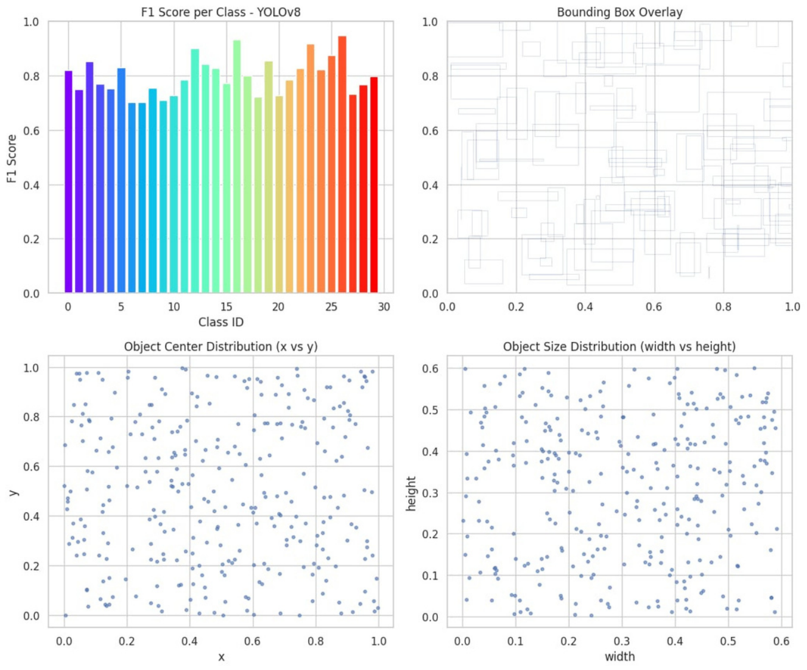
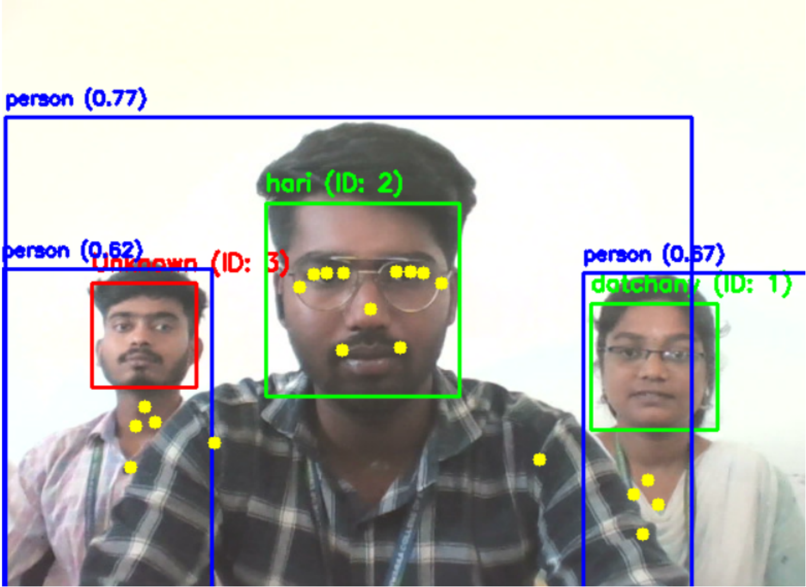
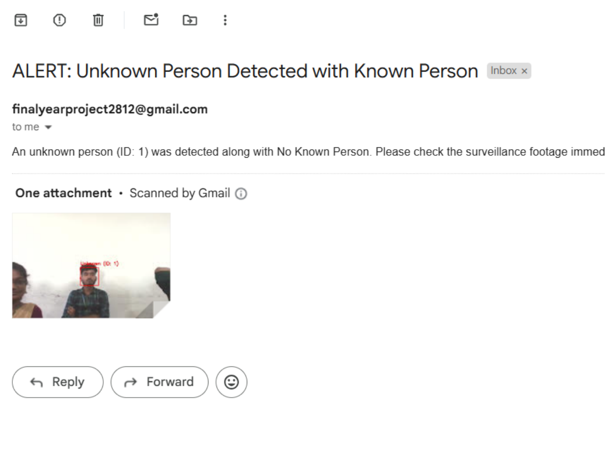
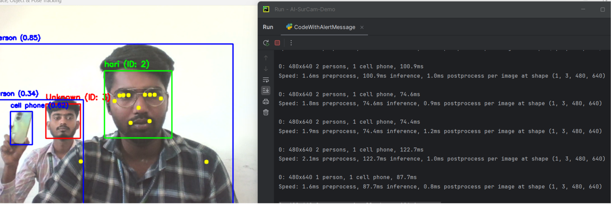

# 🧠 AI-SurCam: Real-Time Anomaly Detection for Urban Areas

> 🚨 **AI-SurCam** is an intelligent surveillance system that integrates **Face Recognition**, **Object Detection**, and **Pose Estimation** to detect anomalies in real-time and send **automated email alerts** — making urban environments smarter and safer.

---

## 🌟 Key Features

| 🚀 Feature | 🧩 Description |
|-------------|----------------|
| 👤 **Face Recognition** | Detects & identifies known/unknown faces using OpenCV's **LBPH algorithm** |
| 🎯 **Object Detection** | Detects real-world objects via **YOLOv8 (Ultralytics)** in real-time |
| 🧍 **Pose Estimation** | Uses **Google MediaPipe** to analyze human posture and keypoints |
| 📸 **Email Alerts** | Automatically sends an **alert with attached image** for unknown faces |
| 🔢 **Person Tracking** | Assigns **unique IDs** to each detected face and maintains detection history |
| 🧠 **Hybrid AI Model** | Combines multiple vision models for enhanced situational awareness |

---

## 🧠 YOLOv8 Object Detection Results

The YOLOv8 model was trained and evaluated on multi-class datasets. Below is an example of performance visualization — showing **per-class F1-scores**, **bounding box overlay**, and **object distribution**.

  

---

## 🛠️ Technology Stack

| Category | Technologies |
|-----------|---------------|
| **Programming Language** |  |
| **Computer Vision** |  |
| **Object Detection** |  |
| **Pose Estimation** |  |
| **Machine Learning Backend** |  |
| **Data Processing** |   |
| **Email & Alerts** |   |
| **Reporting & Visualization** |  |
| **Framework** |  |
| **License** |  |

---

## 📹 Real-Time Detection & Tracking

During real-time surveillance, AI-SurCam identifies each face with unique IDs and confidence scores, along with keypoints for pose tracking.

  

---

## ✉️ Email Alert Example

When an **unknown person** is detected near a **known individual**, the system automatically captures the frame and sends an alert email with an image attachment.

  

---

## ⚙️ Customization

| Parameter           | Default | Description                  |
| ------------------- | ------- | ---------------------------- |
| `confidence < 80`   | 80      | Face recognition sensitivity |
| `elapsed_time > 30` | 30s     | Time before alert trigger    |
| `scaleFactor=1.2`   | 1.2     | Face detection scale         |
| `minNeighbors=5`    | 5       | Face detection accuracy      |

---

## 📸 Sample Outputs

| 🧠 Detection        | 📷 Example                             |
| ------------------- | -------------------------------------- |
| **Face Detection**  |  |
| **Pose Estimation** |  |

---

## 🏙️ Real-World Use Cases

* 🏠 **Smart Home Security**
* 🏢 **Corporate Building Monitoring**
* 🛒 **Retail Theft Prevention**
* 🚦 **Urban Surveillance Networks**
* 🎟️ **Event Safety & Crowd Management**

---

## 🧩 Future Enhancements

* 🔍 Intruder Behavior Prediction using Deep Learning  
* ☁️ Cloud-based Alert Dashboard (AWS / Firebase)  
* 📱 Mobile App Notification System  
* 🧾 Automated Report Generation (PDF/Heatmap)

---

## 📜 License

This project is licensed under the **MIT License**.  
© 2025 Hariprasath. All rights reserved.
